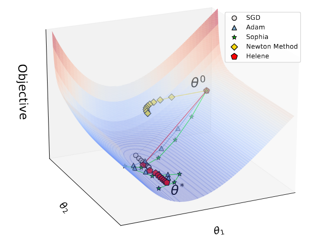








Hi there👋I am Jiaxi Li, a Ph.D. student at the University of Georgia. I obtained my Bachelor's degree in Computer Science from Shandong University in June 2024.

My research interests lie in Machine Reasoning and Large Language Models. 

<!-- # 🔥 News -->

<!-- # 📝 Selected Publications -->
# 📝 Publications and Preprints
\* Equal Contribution; $\dagger$ Corresponding Author.

Preprint

[HELENE: Hessian Layer-wise Clipping and Gradient Annealing for Accelerating Fine-tuning LLM with Zeroth-order Optimization](https://arxiv.org/abs/2411.10696)

Huaqin Zhao\*, **Jiaxi Li\***, Yi Pan, Shizhe Liang, Xiaofeng Yang, Wei Liu, Xiang Li, Fei Dou, Tianming Liu, Jin Lu

Quick Introduction

We introduce HELENE, an optimization algorithm to accelerate fine-tuning LLMs with zeroth-order optimization by integrating an asymptotic Gauss-Newton-Bartlett (A-GNB) estimator for unbiased Hessian approximation and a layer-wise clipping mechanism for adaptive updates.

<!-- [**Project**](https://scholar.google.com/citations?view_op=view_citation&hl=zh-CN&user=DhtAFkwAAAAJ&citation_for_view=DhtAFkwAAAAJ:ALROH1vI_8AC) -->
<!-- <strong></strong> -->
<!-- - We introduce HELENE (Hessian Layer-wise Clipping and Gradient Annealing), an optimization algorithm to accelerate fine-tuning LLMs with zeroth-order optimization. -->

<!-- - [Lorem ipsum dolor sit amet, consectetur adipiscing elit. Vivamus ornare aliquet ipsum, ac tempus justo dapibus sit amet](https://github.com), A, B, C, **CVPR 2020** -->

# 📖 Educations
- *2020.09 - 2024.06*, Shandong University, B.E. in Computer Science and Technology. 
- *2024.08 - current*, University of Georgia, Ph.D. in Computer Science.

# 💬 Selected Presentations
- *2023.10*, When do graph neural networks work on node classfication task and when not? [\[Blog\]](https://hackmd.io/@QpKVe67xTdOFuQ9_s2hbyA/B1qSq09g6) [\[知乎\]](https://zhuanlan.zhihu.com/p/662077835)
- *2024.10*, Scaling up test-time compute for LLM reasoning. [\[Slides\]](./data/Scaling_LLM_Test-Time_Compute_split.pdf)

# 🎖 Honors and Awards
- *2024.06* Outstanding graduate of Shandong Province.

