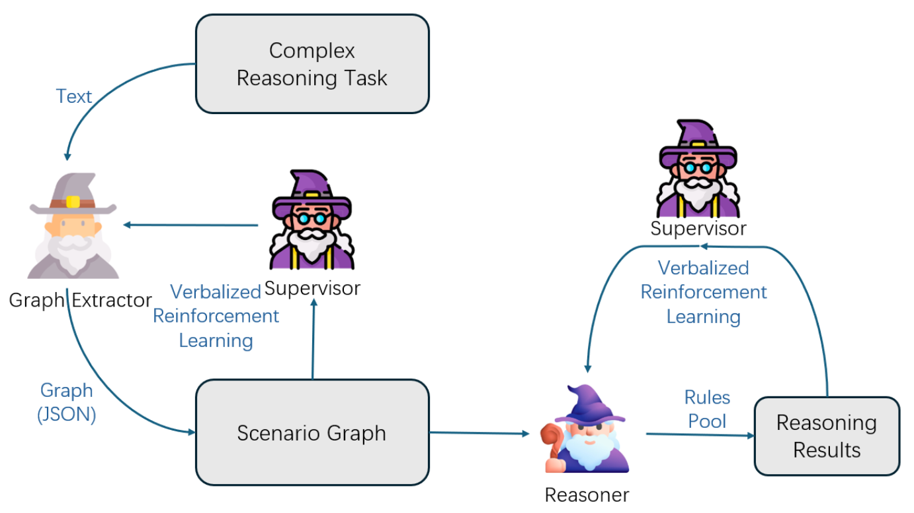








<!-- a first-year Ph.D. student at the University of Georgia. -->
Hi there👋I am Jiaxi Li, a PhD student at the University of Georgia. I obtained my Bachelor's degree in Computer Science from Shandong University in June 2024.

My research interests lie in Large Language Models (LLMs) and particularly in LLM reasoning.
For their applications, I have experience in applying LLMs to the domains of healthcare and law with RAG (Retrieval-augmented Generation). I also worked on Graph Neural Networks (GNNs) before.

Currently I'm working on the following projects:
- LLM Reasoning: I am working on searching algorithms and post-training for LLM system-2 reasoning.
- Healthcare: To evaluate how knowledgeable of LLMs in healthcare and medical problems.
<!-- I also have experience in applying LLMs to healthcare applications.  -->
<!-- My research interests lie in Machine Learning and Machine Reasoning, particularly in Large Language Models and their applications in Healthcare. -->

# 🔥 News
<!-- - *2024.10* &nbsp;🔜🔜 Our paper HELENE: Hessian Layer-wise Clipping and Gradient Annealing for Accelerating Fine-tuning LLM with Zeroth-order Optimization is available in arxiv. -->
- *2024.10* &nbsp;🔜🔜 One paper submitted to ICLR 2025 (Equal Contribution).
<!--- *2024.09* &nbsp;🎉🎉 Our Evaluation Report on OpenAI o1 is available in [arXiv](https://arxiv.org/pdf/2409.18486). -->

# 📝 Selected Publications
Coming soon!

<!-- 

Preprint

[HELENE: Hessian Layer-wise Clipping and Gradient Annealing for Accelerating Fine-tuning LLM with Zeroth-order Optimization](plusnli.github.io)

Huaqin Zhao$^*$, **Jiaxi Li$^*$**, Yi Pan, Shizhe Liang, Xiaofeng Yang, Fei Dou, Tianming Liu, Jin Lu (Equal Contribution) -->

<!-- [**Project**](https://scholar.google.com/citations?view_op=view_citation&hl=zh-CN&user=DhtAFkwAAAAJ&citation_for_view=DhtAFkwAAAAJ:ALROH1vI_8AC) -->
<!-- <strong></strong>
- We introduce HELENE (Hessian Layer-wise Clipping and Gradient Annealing), an optimization algorithm to accelerate fine-tuning LLMs with zeroth-order optimization.

 -->

<!-- - [Lorem ipsum dolor sit amet, consectetur adipiscing elit. Vivamus ornare aliquet ipsum, ac tempus justo dapibus sit amet](https://github.com), A, B, C, **CVPR 2020** -->

<!-- # 🔨 Selected Projects

project

Graph-LLM-Reasoner (Intern in [TMLR Group](https://bhanml.github.io/))

[**Description**]
<strong></strong>
- We construct an interesting reasoning benchmark based on theft scenarios which tests the limitation of LLMs’ logical reasoning abilities.
- We build graph-llm-reasoner, a framework for LLM to solve complex reasoning problems.
- We extract rations from the problem and generate its graph representation, on which LLMs can probe and reason for the problem.

 -->

# 📖 Educations
- *2020.09 - 2024.06*, Shandong University, B.E. in Computer Science and Technology. 

<!-- # 💻 Internships
- *2024.03 - now*, TMLR Group led by Dr. [Bo Han](https://bhanml.github.io/), Hong Kong Baptist University, working with [Zhanke Zhou](https://andrewzhou924.github.io/) (remote).
- *2024.08 - 2024.10*, UCLA, working with Dr. [Yiwei Wang](https://wangywust.github.io/) (remote). -->

# 💬 Selected Presentations
- *2023.10*, When do graph neural networks work on node classfication task and when not? [\[Blog\]](https://hackmd.io/@QpKVe67xTdOFuQ9_s2hbyA/B1qSq09g6) [\[知乎\]](https://zhuanlan.zhihu.com/p/662077835)
- *2024.10*, Scaling up test-time compute for LLMs reasoning. [\[Slides\]](./data/Scaling_LLM_Test-Time_Compute.pdf)

# 🎖 Honors and Awards
- *2024.06* Outstanding graduate of Shandong Province.
- *2021/2022/2023.11* Three times of Third Prize of the Academic Excellence Award, Shandong University.

